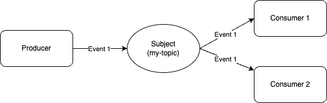

# Pub Sub model

A pub sub communication model distribute messages on a one-to-many model. A publisher sends a message via a subject to consumers listening or subscribed to a subject on NATS broker.



## Examples

### Example 1 - Simple one-to-many

This example [./pubsub/ex1/main.go](./ex1/main.go) demonstrates a simple one producer to two consumers arrangement via a subject name `my-topic`.

### Example 2 - Subject-based messaging

This example [./pubsub/ex2/main.go](./ex2/main.go) demonstrates an example of filtering messages by subject (or stream) name (see [Subject-Based Messaging](https://docs.nats.io/nats-concepts/subjects)).

In this example there are:

* 1 producer pushing messages to `time.eu.uk.london`.
* Consumer (1) subscribing to `time.eu.uk.london`
*  Consumer (2) subscribing to `time.eu.uk.*`
*  Consumer (3) subscribing to `time.eu.*`
*  Consumer (4) subscribing to `time.eu.>`

The result of running the example is as follows:

```sh
2025/02/04 20:29:50 Published event: {"criticality":5,"timestamp":"2025-02-04T20:29:50Z","eventMessage":"Random security event"}
2025/02/04 20:29:50 ConsumerID: 1 Received event: {Criticality:5 Timestamp:2025-02-04T20:29:50Z EventMessage:Random security event}
2025/02/04 20:29:50 ConsumerID: 4 Received event: {Criticality:5 Timestamp:2025-02-04T20:29:50Z EventMessage:Random security event}
2025/02/04 20:29:50 ConsumerID: 2 Received event: {Criticality:5 Timestamp:2025-02-04T20:29:50Z EventMessage:Random security event}
```

Consumer 3 does not receive any message.